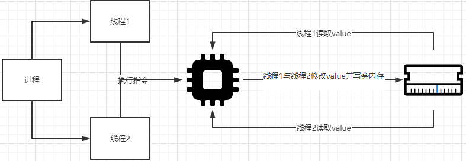

## 操作系统简介
1. 一个正在运行的程序会做一件非常简单的事情：执行指令，过程：处理器从内存中获取（fetch）一条指令，对其进行解码
   （decode），然后执行（execute）它，做它应该做的事，如两个数相加、访问内存、检查条件、跳转函数等。完成这条
   指令后，处理器继续执行下一条指令，以此类推，直到程序最终完成。
1. 有一类软件负责让程序运行变得容易，允许程序共享内存，让程序能够与设备交互，以及其他类似的工作，这类软件称为操
   作系统（operating system）。
1. 操作系统负责确保系统既易于使用又正确高效的运行，主要利用一种通用的技术，我们称之为虚拟化。即操作系统将物理资
   源（如处理器、内存或磁盘）转换为更通用、更强大且更易于使用的虚拟形式。
1. 为了让用户可以告诉操作系统做什么，从而利用虚拟机的的功能（如运行程序、分配内存或访问文件），操作系统还提供了
   一些API接口供你调用。
## 虚拟化CPU
在硬件的一些帮助下，操作系统负责提供一种假象，即系统拥有非常多的虚拟CPU。将单个CPU或其中一小部分转换成看似无限
数量的CPU，从而让许多程序看似同时运行，这就是所谓的虚拟化CPU。
## 虚拟化内存
1. 现代机器提供的物理内存模型非常简单，内存就是一个字节数组。要读取（read）内存，必须指定一个地址（address），
   才能访问存储在那里的数据。写入（write）或更新（update）内存，还必须指定要写入给定地址的数据。
1. 程序在运行时，一直要访问内存。程序将所有数据结构保存在内存中，并通过各种指令来访问他们。程序的每个指令也都在
   内存中，因此每次读取指令都会访问内存。
1. 在程序运行时，每个进程访问自己的私有虚拟地址空间（virtual address space），操作系统以某种方式映射到机器的
   物理内存上。一个正在运行的程序中的内存引用不会影响其他进程或操作系统本身的地址空间。对于正在运行的程序，它完
   全拥有自己的物理内存。但实际上物理内存是有操作系统管理的共享资源，这就是操作系统虚拟化内存。
## 并发
1. 并发这个术语指代一系列问题，这些问题在同时（并发地）处理很多事情时出现且必须解决。并发问题首先出现在操作系统
   本身，如虚拟化的例子中，操作系统同时处理很多事情，首先运行一个进程，然后再运行一个进程等等。
1. 并发问题不仅局限于操作系统本身，事实上现代多线程（multi-threaded）程序也存在相同的问题。
       
1. 如上图所示，当进程中多个线程同时修改内存中的同一个变量时，由于该过程是由多条指令构成（从内存加载数据到寄存器
   ，修改数据，将数据保存回内存），并且这几条指令不是以原子（atomically）方式执行，即并非一次性执行，则会出现不
   可预估的现象。
## 持久性
1. 在系统内存中，数据容易丢失，如DRAM这样的设备以易失（volatile）的方式存储数值，一旦断电或系统崩溃，那么内存
   中的所有数据都会丢失，因此我们需要硬件和软件来持久地存储数据，数据对于客户才有价值。
1. 操作系统中管理磁盘的软件通常称为文件系统，它们负责以可靠和高效的方式，将用户创建的任何文件存储在系统的磁盘上。
1. 对于磁盘，操作系统更不会像对CPU和内存那样为每个应用程序创建专用的虚拟磁盘，相反，它假设用户经常需要共享文件中
   的信息。
## 设计目标
1. 操作系统最基本目标就是建立一些抽象，让系统方便和易于使用。
1. 提供高性能，即最小化操作系统的开销。
1. 在应用程序之间及在OS和应用程序之间提供保护。保护是操作系统基本原理之一的核心，即隔离。让进程彼此隔离是保护的
   关键。
1. 提供高度的可靠性、安全性等
