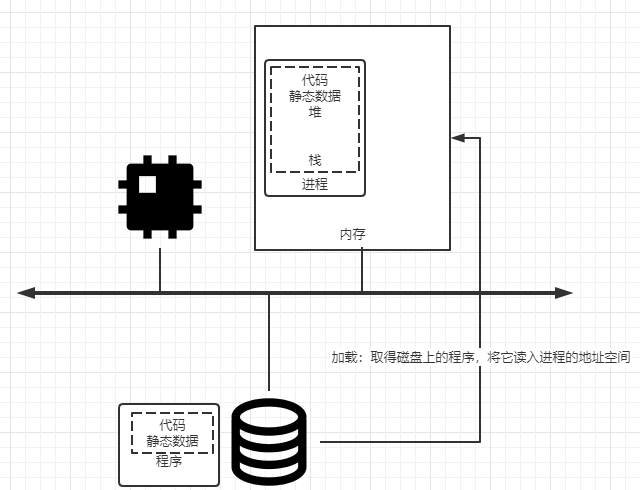

## 进程简介
1. 进程（process）是操作系统提供的基本抽象，进程就是运行中的程序。程序本身没有生命周期，它只是存在磁盘上的一些
   指令，是操作系统让做这些字节运行起来，让程序发挥作用。
1. 操作系统通过让一个进程只运行一个时间片，然后切换到其他进程来虚拟化CPU提供存在多个虚拟CPU的假象，这就是时分
   共享（time sharing）CPU技术，允许用户如愿运行多个并发的进程。
## 进程
1. 进程的机器状态（mechine state）有一个明显的组成部分，就是内存。指令存在内存中，正在运行的程序读取和写入的数
   据也在内存中，因此进程可以访问的内存（地址空间，address space）是该进程的一部分。
1. 进程的机器状态的另一部分是寄存器，许多指令明确地读取或更新寄存器，因此它们对于执行该进程很重要。
1. 程序也经常访问持久存储设备，此类I/O信息可能包含当前打开的文件列表。
## 操作系统必须包含的进程API
1. 创建（create）：操作系统个必须包含一些创建新进程的方法。如在shell中键入命令或者双击应用程序图标，会调用操作
   系统来创建新进程，运行指定程序。
1. 销毁（destroy）：由于存在创建进程的接口，因此系统还提供了一个强制销毁进程的接口。
1. 等待（wait）：有时等待进程停止运行时有用，因此经常提供某种等待接口。
1. 其他控制（miscellaneous control）：除了杀死或等待进程外，有时还可能有其他控制。如大多数操作系统提供某种方
   法来暂停进程，然后恢复。
1. 状态（status）：通常也有一些接口可以获得有关进程的状态信息。
## 进程创建细节（程序如何转化为进程）
      
1. 程序最初以某种可执行格式驻留在磁盘上。操作系统运行程序必须做的第一件事是将代码和所有静态数据加载（load）到
   内存中，加载到进程的地址空间。早期操作系统中，加载过程尽早完成即在运行程序之前全部完成。现代操作系统惰性执
   行该过程即仅在程序执行期间需要加载的代码或数据片段才会加载。
1. 将代码和静态数据加载到内存后，操作系统弄在运行此进程之前还需要执行其他一些操作。必须为程序的运行时栈（run-time stack）
   分配一些内存。C程序一般使用栈存放局部变量、函数参数和返回地址。操作系统分配这些内存并提供给进程，也有可能会
   初始化栈，例如将参数填入main函数即argc和argv数组。
1. 操作系统也可能为程序的堆（heap）分配一些内存，在C程序中堆用于显示请求的动态分配数据，通过malloc()来请求这
   样的空间，并通过free()来明确释放它。数据结构（如链表、散列表、树和其他的数据结构）需要堆，起初堆会很小，随
   着程序运行，可以通过API请求更多内存。
1. 操作系统还将执行一些其他初始化任务，特别是与输入/输出（I/O）相关的任务。如UNIX系统中，默认情况下每个进程都
   有3个打开的文件描述符，用于标准输入、输出和错误。
1. os为程序搭好以上舞台后进行最后一项任务：启动程序，在入口处运行，即main函数。通过跳转到main()函数，OS将CPU
   的控制权转移到新创建的进程中从而程序开始执行。
