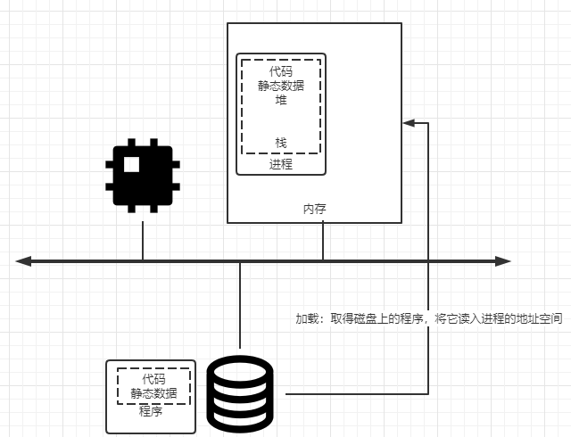

## 进程简介
1. 进程（process）是操作系统提供的基本抽象，进程就是运行中的程序。程序本身没有生命周期，它只是存在磁盘上的一些
指令，是操作系统让做这些字节运行起来，让程序发挥作用。
1. 操作系统通过让一个进程只运行一个时间片，然后切换到其他进程来虚拟化CPU提供存在多个虚拟CPU的假象，这就是时分
共享（time sharing）CPU技术，允许用户如愿运行多个并发的进程。
## 进程
1. 进程的机器状态（mechine state）有一个明显的组成部分，就是内存。指令存在内存中，正在运行的程序读取和写入的数
据也在内存中，因此进程可以访问的内存（地址空间，address space）是该进程的一部分。
1. 进程的机器状态的另一部分是寄存器，许多指令明确地读取或更新寄存器，因此它们对于执行该进程很重要。
1. 程序也经常访问持久存储设备，此类I/O信息可能包含当前打开的文件列表。
## 操作系统必须包含的进程API
1. 创建（create）：操作系统个必须包含一些创建新进程的方法。如在shell中键入命令或者双击应用程序图标，会调用操作
系统来创建新进程，运行指定程序。
1. 销毁（destroy）：由于存在创建进程的接口，因此系统还提供了一个强制销毁进程的接口。
1. 等待（wait）：有时等待进程停止运行时有用，因此经常提供某种等待接口。
1. 其他控制（miscellaneous control）：除了杀死或等待进程外，有时还可能有其他控制。如大多数操作系统提供某种方
法来暂停进程，然后恢复。
1. 状态（status）：通常也有一些接口可以获得有关进程的状态信息。
## 进程创建细节（程序如何转化为进程）
      
1. 程序最初以某种可执行格式驻留在磁盘上。操作系统运行程序必须做的第一件事是将代码和所有静态数据加载（load）到内
存中，加载到进程的地址空间。早期操作系统中，加载过程尽早完成即在运行程序之前全部完成。现代操作系统惰性执行该过程
即仅在程序执行期间需要加载的代码或数据片段才会加载。
1. 将代码和静态数据加载到内存后，操作系统在运行此进程之前还需要执行其他一些操作。必须为程序的运行时栈（run-time 
stack）分配一些内存。C程序一般使用栈存放局部变量、函数参数和返回地址。操作系统分配这些内存并提供给进程，也有可能
会初始化栈，例如将参数填入main函数即argc和argv数组。
1. 操作系统也可能为程序的堆（heap）分配一些内存，在C程序中堆用于显示请求的动态分配数据，通过malloc()来请求这样的
空间，并通过free()来明确释放它。数据结构（如链表、散列表、树和其他的数据结构）需要堆，起初堆会很小，随着程序运行，
可以通过API请求更多内存。
1. 操作系统还将执行一些其他初始化任务，特别是与输入/输出（I/O）相关的任务。如UNIX系统中，默认情况下每个进程都有3个
打开的文件描述符，用于标准输入、输出和错误。
1. os为程序搭好以上舞台后进行最后一项任务：启动程序，在入口处运行，即main函数。通过跳转到main()函数，OS将CPU的控
制权转移到新创建的进程中从而程序开始执行。
## 进程状态
1. 在给定的时间进程可能处于一下三种状态之一
    1. 运行（running）：在运行状态下，进程正在处理器上运行，即它正在执行指令。
    1. 就绪（ready）：在就绪状态下，进程已准备好运行，但由于某种原因，操作系统选择不再此时运行。
    1. 阻塞（blocked）：在阻塞状态下，一个进程执行了某种操作，知道发生其他事件时才会尊卑运行。如当进程向磁盘发
    起I/O请求时，它会被阻塞，因此其它进程可以使用处理器。        
      
## 数据结构
1. 操作系统是一个程序，和其他程序一样，它有一些关键的数据结构来跟踪各种相关的信息。如为了跟踪每个进程的状态，操作
系统可能会为所有就绪的进程保留某种进程列表（process list），以及跟踪当前正在运行的进程的一些附加信息，有时候我们
将存储关于进程的信息的个体结构称为进程控制块（Process Control Block，PCB）。
1. 对于停止的进程，寄存器上下文将保存其寄存器的内容。当一个进程停止时，它的寄存器将被保存到内存。通过恢复这些寄存
器（将它们的值返回实际的物理寄存器中），操作系统可以恢复运行该进程，即上下文切换（context switch）。