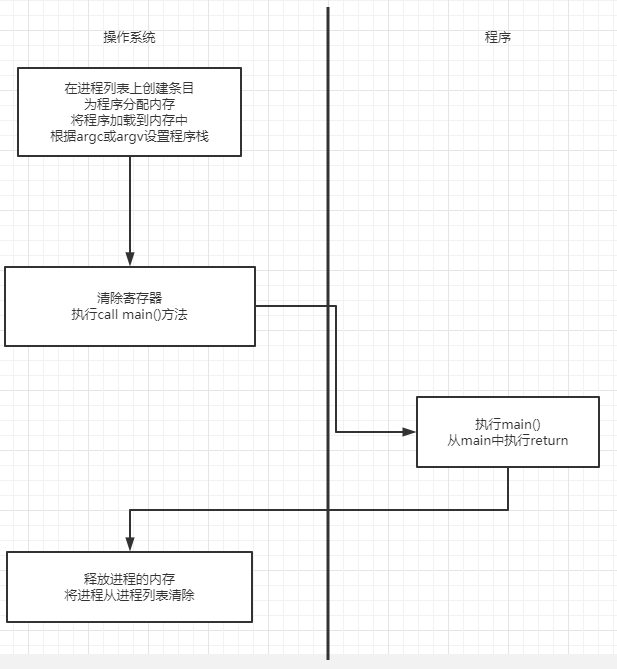

## 机制
1. 操作系统以某种方式让许多任务共享物理CPU，基本思想：运行一个进程一段时间，然后运行另一个进程，如此轮询。
1. 在构建这样的虚拟化机制时存在一些挑战：一个是性能，第二是控制权，即高效、可控地虚拟化CPU。
## 受限直接执行
1. 为了使程序尽可能地快地运行，操作系统开发人员提出了一种技术--受限直接执行（limited direct execution）
1. 直接执行的意思为只需要直接在CPU上运行即可。      
     
1. 直接运行的过程很简单，但是这种方法在虚拟化CPU时产生了一些问题：
    1. 如果只运行一个程序，操作系统怎么能确保程序不做任何不希望它做的事，同时又能高效的运行它
    1. 当我们运行一个进程时操作系统如何让它停下来并切换到另一个线程，从而实现虚拟化CPU所需的时分共享
1. 硬件通过提供不同的执行模式来协助操作系统，在用户模式下应用程序不能完全访问硬件资源，在内核模式下操作系统可以访问机器的
全部资源。还提供了陷入（trap）内核和从陷阱返回（return-from-trup）到用户模式的特别说明，以及一些指令，让操作系统告诉硬
件陷阱表（trap table）在内存中的位置。
1. 直接执行的明显优势是快速，该程序直接在硬件CPU上运行，因此执行速度与预期的意义快，但 对于I/O和其他相关操作一种方法就是
让所有进程做所有它想做的事情，但是这样做导致无法构建一个在授予文件访问权限前检查权限的文件系统，因此不能简单地让任何用户
进程向磁盘发出I/O，如果这样做一个进程就可以读取或写入整个磁盘，所有的保护都会消失。所以采用的方法是引入一种新的处理器模
式称为用户模式，在用户模式下运行的代码会受到限制。
1. 与用户模式不同的内核模式，操作系统（或内核）就是以这种模式运行，此模式下运行的代码可以做它喜欢的事，包括特权操作。
1. 在用户模式的基础上我们限制了程序的运行，但是程序还是有需求执行某种特权操作的（如从磁盘读取等），为了实现这一点，基本
上所有的现代硬件都提供了用户程序执行系统调用的能力，它允许内核小心地向用户程序暴露某些关键功能，如访问文件系统、创建和销
毁进程、与其他进程通信，以及分配更多内存。
1. 要执行系统调用，程序必须执行特殊的陷阱指令，该指令同时跳入内核将特权级别提升到内核模式。一旦进入内核，系统就可以执行
任何需要的允许的特权操作，从而为调用进程执行所需工作。完成后操作系统调用一个特殊的从陷阱返回指令，该指令返回发起调用的用
户程序中，同时将特权级别降低，回到用户模式。
1. 内核通过子啊启动时设置陷阱表（trap table）
## 在进程之间切换
1. 两种方式：
   1. 协作方式（等待系统调用）：操作系统相信系统的进程会合理运行，运行时间过长的进程被假定会定期放弃CPU，以便操作系统可以
      决定运行其他任务。大多数进程通过进行系统调用，将CPU的控制权转移给操作系统，像这样的系统通常包括一个显示的yield调用
      ，其什么都不干，只是将控制权交给操作系统，以便系统可以运行其他进程
   1. 非协作方式（操作系统进行控制）：没有硬件的额外帮助，如果进程拒绝进行系统调用，从而将控制权交还给操作系统，那么操作系
      统无法做任何事情。在协作方式中，当进程陷入无限循环时，唯一的办法就是使用重启来解决。非协作方式采用时钟中断（timer 
      interrupt）来让操作系统重新获得CPU的控制权。时钟设备可以编程为每隔几毫秒产生一次中断，产生中断时当前正在运行的进程
      停止，操作系统中预先配置的中断处理程序会运行，操作系统重新获得CPU的控制权。
1. 保存和恢复上下文：
   1. 操作系统已经重新获得了控制权，无论是通过系统调用协作，还是通过时钟中断更强制执行，此时都必须决定：是继续运行当前进程
   还是切换到另一个进程，这是由调度程序（scheduler）决定的，它是操作系统的一部分。
   1. 如果决定进行切换，OS就会执行一些底层代码，即所谓的上下文切换，上下文切换在概念上很简单：操作系统要做的就是为当前正在
   执行的进程保存一些寄存器的值，并为即将执行的进程恢复一些寄存器的值。这样操作系统就可以确保最后执行从陷阱返回指令时，不是
   返回到之前运行的进程，而是继续执行另一个进程。
