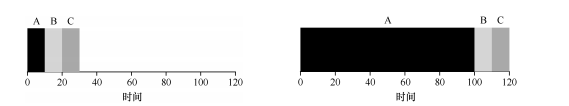
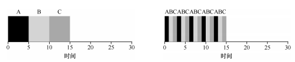
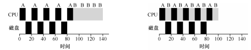

## 先进先出（FIFO）
1. 最基本的调度算法被称为先进先出调度，也可以称为先到先服务（FCFS）
1. FIFO有一些积极的特性：简单且易于实现。但是并不是所有情况下都适合FIFO，当三个任务的工作运行时间都是10s，那么这三个任务
的平均周转时间为（10+20+30）/3=20，但如果第一个任务的工作时间为100s，后两个任务的周转时间都为10s时，平均周转时间就变成了
（100 +110+120）/3=110。
      
1. 上诉问题通常被称为护航效应，一些耗时较少的潜在资源消费者被排在重量级的资源消费者之后。
## 最短任务优先（SJF,Shortest Job First）
1. 最短任务优先：先运行最短的任务，然后是次短的任务，依次执行下去。使用该策略执行FIFO中出现问题案例，平均周转时间为（10 +
20+120）/3=50
1. 当所有工作同时到达时，SJF是一个最优调度算法，但大部分情况下不可能所有任务都同时到达，当上诉案例中耗时最长的任务最先到达
时就和FIFO调度策略没什么区别。
## 最短完成时间优先（STCF, Shortest Time-to-Completion First）
1. 当任务B和C到达时，调度程序可以抢占工作A，并决定运行另一个工作，或许稍后继续工作A，即抢占式调度程序。SJF是一种非抢占式
   调度程序。
1. 最短完成时间优先（抢占式最短作业优先）：每当新工作进入系统时，它就会确定剩余工作和新工作中谁的剩余时间最少，然后调度该
工作。因此在护航效应问题中，STCF将抢占A并运行B和C，并且只有在B和C完成后，才能调度A的剩余时间。则此时平均周转时间为（120
+10+20）/3=50。
1. 此时可以看出，当任务同时到达是SJF为最优，当任务不是同时到达时STCF是最优的。
## 响应时间
如果知道任务长度，而且任务只使用CPU，并且只以任务平均周转时间来衡量效率，那么STCF将是一个很好的策略。然而引入时分系统改变
了这一切。当用户坐在终端钱，同时也要求系统的交互性好，此时一个新的度量指标诞生了：响应时间
## 轮转（Round-Robin，RR）
1. 轮转：RR在一个时间片（time slice）内运行一个工作，然后切换到运行队列中的下一个任务，而不是运行一个任务直到结束，它反复
执行，直到所有任务完成。时间片长度必须是时钟中断周期的倍数，如时钟中断是没10ms一次，那么时间片可以是10ms、20ms或10ms的任 
何其他倍数。
          
1. 如上图所示SJF算法平均响应时间是（0+5+10）/3=5，而RR的平均响应时间是（0+1+2）/3=1，因此时间片的长度对于RR是至关重要的
，越短的时间片RR在响应时间上表现越好。但时间片太短是有问题的：其会导致上下文切换过于频繁影响整体性能。
1. SJF及STCF调度程序优化周转时间，但对响应时间不利。RR优化响应时间，但对周转时间不利。
## 结合I/O
1. 没有I/O的程序是没有意义的，调度程序显然要在工作发起I/O请求时作出决定，因为当前正在运行的作业在I/O期间不会使用任何CPU，
它被阻塞等待I/O完成。如果将I/O发送到硬盘驱动器，则进程可能会被阻塞几秒或更长时间，具体取决于驱动器当前的I/O负载。因此此时
调度程序应该在CPU上安排另一项工作。
1. 调度程序还必须在I/O完成时做出决定，发生这种情况时，会产生中断，操作系统运行将发出I/O的进程从阻塞状态一会就绪状态，甚至
可以决定在那个时候运行该项工作。
1. A和B两个任务都需要50ms，但A运行10ms后发出I/O请求，每个I/O请求需要10ms，而B只使用50ms不执行I/O请求。这时一种常见的方
法试讲A的每个10ms的子工作视为一项独立的工作，一次当系统启动时先选择10ms的A还是50ms的B？对于STCF选择是明确的：选择较短的
一个，在这种情况侠士A，然后A的工作已完成，只剩下B并开始运行，然后提交A的一个新的子工作并抢占B运行10ms，这样做可以实现重叠，
一个进程在等待另一个进程的I/O完成时使用CPU，系统因此得到更好的利用。
   
## 总结（无法预知）
事实上在一个通用的操作系统中，操作系统通常对每个作业的长度知之甚少，所以单一的调度算法是无法满足的。
