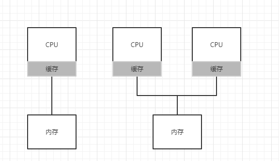
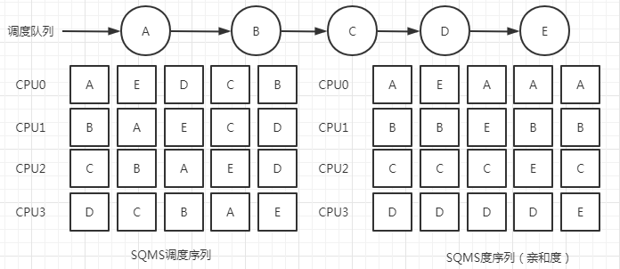

## 简介
早期典型的应用程序都使用一个CPU，增加了更多的CPU并没有让这类程序运行得更快。为了解决这个问题，不得不重写这些应用程序，使
之能并行执行，使用多线程。多线程应用可以将工作分散到多个CPU上，因此CPU资源越多就运行越快。此时就会遇到新问题--多处理器调
度。
## 多处理器架构
1. 多处理器和单处理之间的区别核心在于对硬件的缓存，以及多处理器之间共享数据的方式。在单CPU系统中存在多级的硬件缓存，一般
来说会让处理器更快的执行程序。缓存是很小但很快的存储设备，通常拥有内存中最热的数据备份。相比之下内存很大且拥有所有的数据，
但访问速度较慢。通过频繁访问的数据放在缓存中，系统似乎拥有又大又快的内存。       
     
1. 缓存是基于局部性的，局部性有两种：时间局部性和空间局部性。时间局部性是指当一个数据被访问后，它很可能会在不久的将来被再
次访问，比如循环代码中的数据或指令本身。而空间局部性指的是当程序访问地址为x的数据时，很有可能会紧接着访问x周围的数据，比
如遍历数据或指令的顺序执行。由于这两种局部性存在于大多数的程序中，硬件系统以很好地预测哪些数据可以放入缓存，从而运行的更
好。
1. 如上图如果系统有多个处理器并共享同一个内存，则使得多cpu的缓存要复杂的多。如一个运行在CPU1上的程序从内存地址A读取数据，
由于不在CPU1的缓存中，所以系统直接访问内存，得到值D。程序然后修改了地址A处的值，只是将它的缓存更新为新值D'。将数据写回内
存比较慢，因此系统通常会稍后再做。假设这时操作系统中断了该程序的运行，并将其交给CPU2，重新读取地址A的数据，由于CPU2的缓存
中并没有该数据，所以会直接从内存中读取，得到了旧值D，而不是正确的D‘。
1. 上述问题称为缓存一致性问题。硬件提供了这个问题的基本解决方案：通过监控内存访问，硬件可以保证获得正确的数据，并保证共享
内存的唯一性。在基于总线的系统中，一种方式是使用总线窥探，每个缓存都通过监听链接所有缓存和内存的总线，来发现内存访问。如果
CPU发现对它放在缓存中的数据有更新，就作废本地副本或更新副本。
## 同步
1. 即使缓存做了很多工作来提供一致性，应用程序依然需要关心共享数据的访问，如并发问题。
1. 跨CPU访问尤其是写入共享数据或数据结构时，需要使用互斥原语（比如锁），才能保证正确性。如假设多CPU并发访问一个共享队列，
如果没有锁，即使有底层一致性协议，并发地从队列增加或删除元素，依然不会得到预期结果，需要用锁来保证数据结构状态更新的原子性。
## 缓存亲和度
多CPU调度遇到的最后一个问题是所谓的缓存亲和度。概念：一个进程在某个CPU上运行时，会在该CPU的缓存中维护许多状态。下次该进程
在相同CPU上运行时，由于缓存中的数据而执行得更快。相反，在不同的CPU上执行，会由于需要重新加载数据而很慢。因此多CPU调度应该
考虑到这种缓存亲和性，并尽可能将进程保持在同一个CPU上。
## 单队列调度
1. 多CPU系统的调度程序最基本的方式是简单地复用单CPU调度的基本架构，将所有需要调度的工作放入一个单独的队列中，称为单队列多
处理器调度（single queue multiprocessor scheduling，SQMS），这个方法最大的优点是简单不需要太多修改就可以将原有策略
用于多个CPU，选择最合适的工作来运行。
1. SQMS有几个明显的短板：
    1. 缺乏可扩展性，为了保证多在CPU上正常运行，调度程序的开发者需要在代码中通过加锁来保证原子性。在SQMS访问单个队列时
    （如寻找一个运行的工作），锁确保得到正确的结果。然而，锁可能带来巨大的性能损失，尤其是随着系统中的CPU数增加时。随着
    这个单个锁的争用增加，系统花费了越来越多的时间在锁的开销上，较少的时间用于系统应该完成的工作。
    1. 第二个主要问题是缓存亲和性，假设有5个工作（A、B、C、D、E）和4个处理器则如下图，由于每个CPU都简单地从全局共享的队
    列中选取下一个工作执行，因此每个工作都不断在不同CPU之间转移，这与缓存亲和性的目标背道而驰。为了解决这个问题，大多数
    SQMS调度程序都引入了一些亲和度机制，尽可能让进程在同一个CPU上运行。保持一些工作的亲和度的同时，可能需要牺牲其他工作
    的亲和度来实现负载均衡。这种调度中，A、B、C、D这四个工作都保持在同一个CPU上，只有工作E不断地来回迁移，从而尽可能地
    获得缓存亲和度。为了公平起见，之后可以选择不同的工作来迁移，但实现这种策略可能很复杂。
             
## 多队列调度
1. 由于单队列调度程序存在一些问题，有些系统使用了多队列的方案，比如每个CPU一个队列，称为多队列多处理器调度（MQMS）。
1. 在MQMS中，基本调度框架包含多个调度队列，每个队列可以使用不同的调度规则，比如轮转或其他任何可能的算法。当一个工作进入
系统后，会依照一些启发性规则（如随机或者选择较空的队列）将其放入某个调度队列。这样一来，每个CPU调度之间相互独立，就避免
了单队列的方式中由于数据共享及同步带来的问题。
1. MQMS比SQMS有明显的又是，它天生更具有可扩展性。队列的数量会随着CPU的增加而增加，因此锁和缓存争用的开销不是大问题。此
外MQMS天生具有良好的缓存亲和度。所有工作都保持在固定的CPU上，因而可以很好地利用缓存数据。
1. 同时MQMS也会出现某个CPU的工作队列执行完后闲置的问题，即负载不均，最简单的办法就是让工作移动，称为迁移。通过工作的跨
CPU迁移，可以真正实现负载均衡。
1. 迁移的一个基本方法是采用名为工作窃取的技术，通过这种方法，工作量较少的队列不定期地偷看其他队列是不是比机子的工作多。如
果目标队列比源队列更慢，就从目标队列窃取一个或多个工作，实现负载均衡。
## Linux多处理器调度
在构建多处理器调度程序方面，Linux社区一直没有达成共识，一直以来存在3中不同的调度程序：O(l)调度程序、完全公平调度程序(CFS)
以及BF调度程序(BFS)。前两种采用多队列，而BFS采用单队列。O(l)采用基于优先级的类似于MLFQ的算法。CFS是确定的比例调度方法类
似于步长调度。BFS也是基于比例调度，但采用了更为复杂的方案，称为最早最合适虚拟截止时间优先算法。