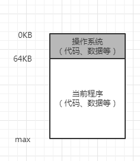
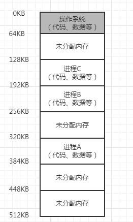
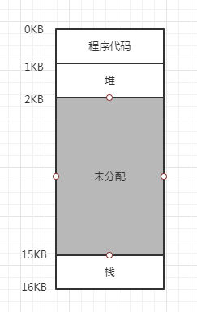

## 早期系统
从内存来看早期的机器并没有提供多少抽象给用户。基本上机器的物理内存看起来如下图所示。操作系统曾经是一组函数，在内存中如图是
从物理地址0开始，然后有一个正在运行的程序，目前物理内存中从物理地址64KB开始，并使用剩余的内存。这几乎没有抽象，用户对操作
系统的要求也不多。       
       
## 多道程序和时分共享
1. 由于机器昂贵，人们开始更有效地共享机器。因此，多道程序系统时代开启，其中多个进程在给定时间准备运行，如当前有一个进程在
等待I/O操作的时候，操作系统会切换这些进程，这样增加了CPU的有效利用率。很快人们开始对机器要求更多，分时系统的时代诞生了，
具体来说许多人意识到批量计算的局限性，尤其是程序员本身厌倦了长时间的编程--循环调试。交互型变的很重要，因为很多用户可能同
时在使用机器，每个人都在等待他们执行的任务及时响应。
1. 一种实现时分共享的方法，是让一个进程单独占用全部内存运行一小段时间，然后停止它，并将它所有的状态信息保存在磁盘上，加载
其他进程的状态信息，再运行一段时间，这就实现了某种比较粗糙的机器共享。但这种方法太慢了，特别是当内存增长的时候。虽然保存
和恢复寄存器级的状态信息（程序计数器、通用寄存器等）相对较快，但将全部的内存信息保存到磁盘就太慢了。因此在进程切换的时候，
仍然将进程信息放在内存中，这样的操作系统可以更有效地实现时分共享。       
      
1. 随着时分共享变的更流行，人们对操作系统又有了新的要求，特别是多个程序同时驻留在内存中，使保护成为重要问题。人们不希望
一个进程可以读取其他进程的内存，更别说修改。
## 地址空间
1. 对于时分共享产生的问题，操作系统需要提供一个易用的物理内存抽象，这个抽象叫做地址空间（address space），是运行程序看
到的系统中的内存。
1. 一个进程的地址空间包含运行的程序的所有内存状态，如程序代码必须在内存中，因此它们在地址空间里。当程序运行时，利用栈（stack）
来保存当前的函数调用信息，分配空间给局部变量，传递参数和函数返回值。最后，堆（heap）用于管理动态分配的、用户管理的内存，
如java汇总调用new获得的内存。还有一些其他东西，如静态初始化变量等内容。假设只有代码、栈和堆三部分内容，如下图          
      
1. 在图中我们有一个很小的地址空间，程序代码位于地址空间的顶部，本例中从0开始并且装入到地址空间的前1KB。代码是静态的，因
此很容易放在内存中，所以可以将它放在地址空间的顶部，因为这部分空间不会再变化不需要新的空间。在程序运行是，地址空间有两个
区域可能增长或者收缩，就是堆或者栈。把它们凡在那里，是因为它们都希望能够增长，通过将它们凡在地址空间的两端，我们可以允许
它们只需要在相反的方向增长，因此堆代码之下开始并向下增长，栈从16KB开始向上增长。然而堆和栈的这种放置方式只是一种约定，如
果你愿意，可以用不同的方式安排地址空间。
1. 我们描述地址空间时，所描述的是操作系统提供给运行程序的抽象，程序不再物理地址0~16KB的内存中，而是加载在任意的物理地址。
1. 当操作系统在单一的物理内存上为多个运行的进程构建一个私有的、可能很大的地址空间，称为操作系统在虚拟化内存（virtualizing 
memory），因为运行的程序人为它被加载到特定地址（例如0）的内存中，并且具有非常大的地址空间。
## 目标
1. 虚拟内存系统的一个主要目标是透明，操作系统实现虚拟内存的方式，应该让运行的程序看不见，因此程序不应该感知到内存被虚拟化
的事实，相反程序的行为就好像它拥有自己的私有物理内存。
1. 另一个目标是效率，操作系统应该追求虚拟化尽可能高效，包括时间上和空间上。在实现高效率虚拟化时，操作系统将不得不依靠硬件
支持，包括TLB这的硬件功能。
1. 最后一个目标是保护，操作系统应确保进程受到保护，不会受其他进程影响，操作系统本身也不会受进程影响。当一个进程执行加载、
存储或指令提取时，它不应该以任何方式访问或影响任何其他进程或操作系统本身的内存内容。保护让我们能够在进程之间提供隔离的特
性，每个进程都应该在自己独立的环境中运行，避免其他出错或恶意进程的影响。