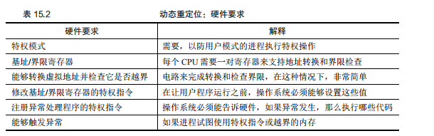

## 简介
1. 在实现CPU虚拟化时，遵循的一般准则被称为受限直接访问（Limited Direct Execution，LDE）。LDE背后的想法也很简单：让程序
运行的大部分指令直接访问硬件，只在一些关键点（如进程发起系统调用或发生时钟中断）由操作系统介入来确保在正确的时间，正确的地点
做正确的事。为了实现高效的虚拟化，操作系统应该尽量让程序自己运行，同时通过在关键点的及时介入，来保持对硬件的控制。
1. 在实现虚拟内存时，最求的也是类似的战略，在实现高效和控制的同时，提供期望的虚拟化。高效决定了要利用硬件的支持，这在开始
的时候非常初级（如使用一些寄存器），但会变得相当复杂（比如TLB、页表等）。控制意味着操作系统要确保应用程序只能访问它自己的
内存空间。最后虚拟内存必须灵活，希望程序能以任何方式访问它自己的地址空间，从而让系统更容易编程。
1. 基于硬件的地址转换简称为地址转换，其可以看成是受限直接执行这种一般方法的补充。利用地址转换，硬件对每次内存访问进行处理，
将指令中的虚拟地址转换为数据实际存储的物理地址。
1. 仅仅依靠硬件不足以实现虚拟内存，因为它只是提供了底层机制来提高效率。操作系统必须在关键的位置介入，设置好硬件，以便完成
正确的地址转换。因此它必须管理内存，记录被占用和空闲的内存位置，并明智而谨慎地介入，保持对内存使用的控制。
## 动态（基于就硬件）重定位
1. 基于硬件的地址转换地刺应用在20世纪50年代后期，它在首次除夕拿的时分机器中引入，那时只是一个简单的思想，称为基址加界限机
制（base and bound），有时又称为动态重定位（dynamic reloaction）。
1. 每个CPU需要两个硬件寄存器：基址寄存器和界限寄存器有时称为限制寄存器。这组基址和界限寄存器，让我们能够将地址空间放在物理
内存的任何位置，同时又确保进程只能访问自己的地址空间。采用这种方式，在编写和编译程序时假设地址空间从零开始。但是当程序真正
执行时，操作系统会决定其在物理内存中的时机加载地址，并将起始地址记录在基址寄存器中。所以当进程运行时，该进程产生的所有内存
引用，都会被处理器通过以下方式转换为物理地址：
   ```
    pyhsical address = virtual address + base
    ```     
1. 进程中使用的内存引用都是虚拟地址，硬件接下来将虚拟地址加上基址寄存器中的内容得到物理地址，再发给内存系统，将虚拟地址转
换为物理地址，这就是所谓的地址转换技术。由于这种重定位是在运行时发生的，而且甚至可以再进程开始运行后改变其地址空间，所以
称之为动态重定位。
1. 界限寄存器提供了访问保护，如界限寄存器被置为16KB，如果进程需要访问超过这个界限或者为负数的虚拟地址，CPU将触发异常，进
程最终可能被终止。界限寄存器的用处在于它确保了进程产生的所有地址都在进程的地址界限中。其有两种使用方式
    1. 一是记录地址空间的大小，硬件在将虚拟地址与基址寄存器内容求和前，就检查这个界限。
    1. 另一种方式是界限寄存器中几率地址空间结束的物理地址，硬件在转化虚拟地址到物理地址之后才去检查这个界限。
1. 这种基址寄存器配合界限寄存器的硬件结构是芯片中的（每个CPU一对），有时将CPU的这个负责地址转换的部分统称为内存管理单元（
Memory Management Unit，MMU）。
## 总结
      
     

如果重定位的进程使用了从32KB到48KB的物理内存，但由于该进程的栈区和堆区并不是很大，导致这块内存区域大量的空间被浪费，这种
浪费称为内部碎片，指的是已经分配的内存单一内部有未使用调度空间，造成了浪费。在当前的方式中，即使有足够的物理内存容纳更多进
程，但我们目前要求将地址空间放在固定大小的槽块中（连续内存空间），因此会出现内部碎片。所以我们需要更复杂的机制，以便更好地
利用物理内存，避免内部碎片。
