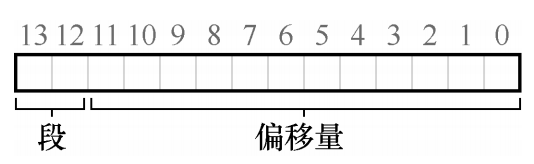
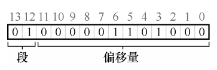
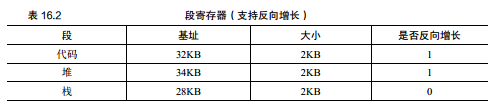
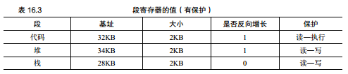

## 简介
到目前为止，一直假设所有进程的地址空间完整地加载到内存中。利用基址和界限寄存器，操作系统很容易将不同进程重定位到不同的物理
内存区域。但是对于这些内存区域，在栈和堆之间，有一大块空闲空间，其并没有被进程使用，却依然占用了实际的物理内存。因此，简单
的通过基址寄存器和界限寄存器实现的虚拟内存很浪费。如果剩余物理内存无法提供连续区域来放置完整的地址空间，进程便无法运行。这
种基址加界限的方式并没有期望的那么灵活，因此怎样支持大地址空间，同时栈和堆之间大量空闲空间怎么不浪费？
## 分段：泛化的基址/界限
分段：在MMU中引入的不仅仅是一个基址和界限寄存器对，而是给地址空间内的每个逻辑段一对。一个段只是地址空间里的一个连续定长
的区域，在典型的地址空间里有3个逻辑不通的段：代码、栈、堆。分段的机制使得操作系统能够将不同的段放到不同的物理内存区域，从而
避免了虚拟地址空间中的未使用部分占用物理内存。
## 确定引用的是哪个段
1. 硬件在地址转换时使用段寄存器，要确定段内的偏移量以及地址引用了哪个段，最常见的方式称为显示方式，就是用虚拟地址的开头几
位来标识不同的段，VAX/VMS系统使用了这种技术。在之前的例子中有3个段，因此需要两位来标识，如果用14位虚拟地址的前两位来标识，
那么虚拟地址如下图所示：            
      
1. 如果前两位是00，硬件就知道这是属于代码段的地址，因此使用代码段的基址和界限来重定位到正确的物理地址。如果前两位是01，则
是堆地址，对应的使用堆的基址和界限。          
          
1. 如上图所示前两位（01）告诉我们引用那个段，剩下的12位是段内偏移：0000 0110 1000（即十六进制0x68或十进制104）。因此，
硬件就用前两位来决定使用那个段寄存器，然后用后12位作为段内偏移量。偏移量与基址寄存器相加硬件就得到了最终的物理地址。偏移
量也简化了对段边界的判断，只要检查偏移量是否小于界限，大于界限的为非法地址。
1. 上面使用两位来区分段，但实际只有3个段，因此有一个段的地址空间被浪费，有些系统会将堆和栈当作同一个段，只需要一位来标识。
1. 硬件还有其他方法来决定特定地址在哪个段，称为隐式方式，硬件通过地址产生来确定段，如地址有程序计数器产生，那么地址在代码
段，如果基于栈或基于指针，他一定在栈段，其他地址则在堆段。
## 栈如何确定
1. 栈与代码段和堆段的关键区别在于它是反向增长的，如在物理内存中，它始于28KB，增长回到26KB，相应虚拟地址从16KB到14KB，地
址转换必须有所不同。
1. 除了基址和界限外，硬件还需要知道段的增长反向（用以为区分，比如1代表自小而大增长，0反之）。           
          
1. 假设要访问虚拟地址15KB，它应该映射到物理地址27KB，该虚拟地址的二进制是：11 1100 0000 0000（十六进制0x3C00）。硬件
利用前两位（11）来指定段，然后我们要处理偏移量3KB，为了得到正确的反向偏移，必须从3KB中减去最大的段地址：在此例中段可以是
4KB，因此正确的偏移量是3KB减去4KB即-1KB。只要用这个反向的偏移量加上基址28KB，就得到了正确的27KB。用户可以进行界限检查，
确保反向偏移量的绝对值小于段的大小。
## 支持共享
1. 为了支持共享，需要一些额外的硬件支持，这就是保护位（protection bit）。基本做法为每个段增加几个位，标识程序是否能够读
写该段，或执行其中的代码。通过将代码段标记为只读，同样的代码可以被多个进程共享，而不用担心破坏隔离。虽然每个进程都人为自己
独占这块内存，但操作系统秘密地共享了内存，进程不能修改这些内存，所以假象得以保持。       
          
1. 为了保护位，前面描述的硬件算法也必须改变，除了检查虚拟地址是否越界，硬件还需要检查特定访问是否允许。如果用户进程试图写
入只读字段，或从非执行段执行指令，硬件会触发异常，让操作系统来处理出错进程。
## 细粒度与粗粒度的分段
1. 前面讨论的代码、栈、堆这三个段可以认为这种分段是粗粒度，因为它将地址空间分成较大的、粗粒度的块。但是一些早期系统更灵活
，允许将地址空间划分为大量较小的段，这被称为细粒度分段。
1. 支持许多段需要进一步硬件支持，并在内存中保存某种段表（segment table）。这种段表通常支持创建非常多的段，因此系统使用段
的方式，可以比之前讨论的更灵活。
## 操作系统支持
1. 分段带来了一些列问题：
    1. 操作系统在上下文切换时应该做什么？各段寄存器中的内容必须保存和恢复，每个进程都有自己独立的虚拟地址空间，操作系统必
    须在进程运行钱，确保这些寄存器被正确赋值。
    1. 管理内存的空闲空间，新的地址空间被创建时，操作系统需要在物理内存中为它的段找到空间。一般遇到的问题是，内存很快充满
    了许多空闲的小洞，因而很难分配给新的段，或扩大已有的段，这种问题被称为外部碎片。            
              
1. 如一个进程需要分配一个20KB的段，当前有24KB空闲，但并不是连续的，因此，操作系统无法满足这个20KB的请求。该问题的一种解
决方案是紧凑（compact）物理内存，重新安排原有的段。例如操作系统先终止运行的进程，将它们的数据复制到连续的内存区域中去，
改变它们的段寄存器中的值，指向新的物理地址从而得到了足够大的连续空闲空间。这样做，操作系统能让新的内存分配请求成功。但是
内存紧凑的成本很高，因为拷贝段是内存密集型的，一般会占用大量的处理器时间。
1. 一种更简单的做法是利用空闲列表管理算法，试图保留大的内存块用于分配。相关的算法很多包括传统的最优匹配（best-fit，从空
闲链表中找最接近需要分配空间的空闲块返回）、最坏匹配（worst-fit）、首次匹配（first-fit）以及像伙伴算法这样更复杂的算法。

