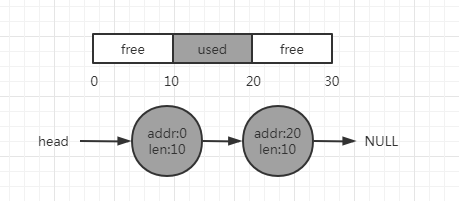
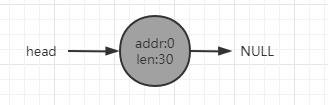
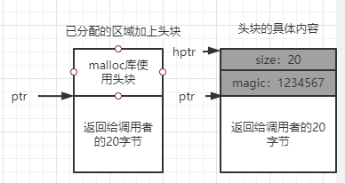
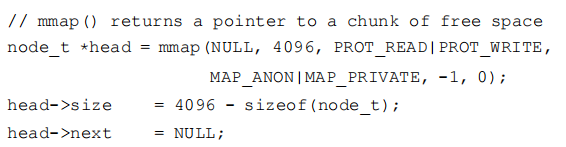
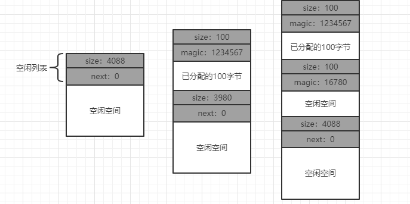
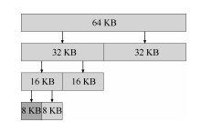

## 简介
当需要管理的空间被划分为固定大小的单元，就很容易。在这种情况下，只需要维护这些大小固定的单元的列表，如果有请求就返回列表中
的第一项。如果要管理的空闲空间由大小不同的单元构成，管理就变的困难了，这种情况出现在用户级的内存分配库（如molloc()和
free()），或者操作系统用分段的方式实现虚拟内存。这两种情况下会出现外部碎片的问题。
## 底层机制
### 分割与合并
1. 空闲列表包含一组元素，记录了堆中的哪些空间还没分配，假设有下面的30字节的堆：这个堆对应的空闲列表会有两个元素，一个描述
第一个10字节的空闲区域（字节0~9），一个描述另一个空闲区域（20~29）      
     
1. 上图可以看出任何大于10字节的分配请求都会失败（返回NULL），因为没有足够连续可用空间。而恰好10字节的分配的需求可以由两个
空闲块中的任何一个满足。如果申请小于10字节，如只申请一个字节内存，这种情况下分配程序就会执行所谓的分割（splitting）动作：
它找到一块可以满足请求的空闲空间，将其分割第一块返回给用户，第二块留在空闲列表。
1. 许多分配程序中因此也有一种机制，名为合并（coalescing）。如上述例子中应用程序调用free(10)，归还堆中间的空间。为了避免
归还后虽然都是空闲空间，但是被分成了3个10字节的区域，此时如果用户申请20字节的空间，简单遍历空闲列表会找不到这样的空闲块，
因此返回失败。
1. 为了避免上述问题，分配程序会在释放一块内存时合并可用空间：在归还一块空闲内存时，仔细查看要归还的内存块的地址以及邻近的
空闲块，如果新归还的空间与一个原有空闲块相邻，就将它们合并为一个较大的空闲空间，通过合并最后空闲列表应该如下图：        
     
1. 通过合并，分配程序可以更好地确保大块的空闲空间能提供给应用程序。
### 追踪已分配空间的大小
1. free(void *ptr)接口没有块大小的参数，因此它是假定对于给定的指针，内存分配库可以很快确定要释放空间的大小，从而将它放
回空闲列表。
1. 要完成上述任务，大多数分配程序都会在头块（header）中保存一些额外的信息，它在内存中，通常就在返回的内存块之前。如下图
例子中，我们检查一个20字节的已分配块，由ptr指着，用户调用了malloc()，并将结果保存在ptr中：ptr=malloc(20)，该头块中至
少包含所分配空间的大小，也可能包含一些额外的指针来加速空间释放，包含一个幻数来提供完整性检查以及其他信息。       
     
1. 获得头块的指针后，库可以很容地确定幻数是否符合预期的值，作为正常性检查，并简单计算要释放的空间大小（即头块的大小加上区
域长度）。
### 嵌入空闲列表
1. 如果要分配新节点，调用malloc()来获取该节点所需的空间，遗憾的是，在内存分配库中无法这么做，还需要在空闲空间本身中建立
空闲空间列表。
1. 假设我们需要管理一个4096字节的内存块，为了将它作为一个空闲空间列表来管理，首先要初始化这个列表。开始，列表只有一个条目
，记录了大小为4096的空间（减去头块的大小）。
     
1. 上图代码中初始化堆，并将空闲列表的第一个元素放在该空间中，假设构建在某块空闲空间上，这块空闲空间通过系统调用mmap()获
得，mmap不是构建这种堆的唯一选择。执行代码后，列表的状态是它只有一个条目，记录大小为4088。       
       
## 基本策略
理想的分配程序可以同时保证快速和碎片最小化，但是由于分配及释放的请求序列是任意的，任何特定的策略在某组不匹配的输入下都会
变得非常差，所以没有最好的策略一下知识基本的选择。
### 最优匹配（best fit）
最优匹配策略：首先遍历整个空闲列表，找到和请求大小一样或者更大的空闲块，然后返回这组候选者中最小的一块，其尽量避免浪费空
间，但简单的实现在遍历查找正确的空闲块时，要付出较高的性能代价。
### 最差匹配（worst fit）
最差匹配与最优匹配相反，它尝试找最大的空闲块，分割并满足用户需求后，将剩余的块加入空闲列表。最差匹配尝试在空闲列表中保留
较大的块，而不是像最优匹配那样可能剩下很多难以利用的小块。但是最差匹配同样要遍历整个空闲列表并且会产生过量的碎片。
### 首次匹配（first fit）
首次匹配策略就是找到第一个足够大的块，将请求的空间返回给用户，剩余的空闲空间同样留给后续请求。其有速度的优势，但有时会让
空闲列表开头的部分有很多小块。因此分配程序如何管理空闲列表的顺序就变得很重要，一种方式是基于地址排序，通过保持空闲块按内
存地址有序，合并操作会很容易，从而减少内存碎片。
### 下次匹配（next fit）
下次匹配算法多维护一个指针，指向上一次查找结束的位置，其想法是将对空闲空间的查找操作扩散到整个列表中去，避免对列表开头频
繁的分割。这种策略的性能与首次匹配接近，同样避免了遍历查找
## 其他方式
除了上述基本策略外，人们还提出了许多技术和算法来改进内存分配。
### 分离空闲列表（segregated list）
分离空闲列表：如果某个应用程序经常申请一种大小的内存空间，那就用一个独立的列表，只管理这样大小的对象，其他大小的请求都交
给更通用的内存分配程序。
### 伙伴系统
二分伙伴分配程序（binary buddy allocator）：这种系统中，空闲空间首先从概念上被看成大小为2^N的大空间，当有一个内存分配
请求时，空闲空间被递归地一分为二，知道干好可以满足请求的大小。这是请求的块被返回给用户。优点在于如下图将这第一个8KB归还给
空闲列表时，分配程序会检查右边的第二个伙伴8KB是否空闲，如果是就合并成16KB的块，然后继续检查这个16KB块的伙伴是否空闲，以此
类推。

