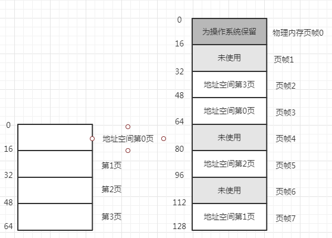
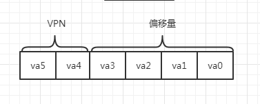
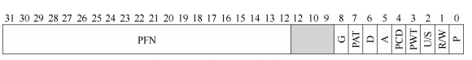
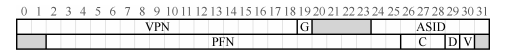

## 介绍
操作系统有两种方法来解决大多数空间管理问题：
    1. 将空间分割成不同长度的分片，就像虚拟内存管理中的分段。可是这个解决方法存在固有问题：将空间切成不同长度的分片以后，
    空间本身会碎片化，随着时间推移，分配内存会变得比较困难。
    1. 将空间分割成固定长度的分片，在虚拟内存中我们称之为分页，分页不是将一个进程的地址空间分割成几个不同长度的逻辑段，而
    是分割成固定大小的单元，每个单元称为一页。相应地把物理内存看成是定长槽块的阵列叫作页帧，每个页帧包含一个虚拟内存页。
### 实例
1. 如下图所示一个只有64字节的小地址空间，有4个16字节的页（虚拟页0、1、2、3）。真实的地址空间肯定大得多，通常32位有4GB的
地址空间。物理内存也是由一组固定大小的槽块组成，在下例中有8个页帧，虚拟地址空间的页放在物理内存的不同位置。          
     
1. 从上例可以看出与之前的方法相比，分页有许多优点。可能最大的改进就是灵活性：通过完善的分页方法，操作系统能够高效地提供地
址空间的抽象，不管进程如何使用地址空间，如不会假定堆和栈的增长方向以及它们如何使用。另一个优点是分页提供的空闲空间管理的
简单性，如果操作系统希望将64字节的小地址放到8页的物理地址空间中，它只要找到4个空闲页。
1. 为了记录地址空间的每个虚拟页放在物理内存中的位置，操作系统通常为每个进程保存一个数据结构，称为页表。页表的主要作用是为
地址空间的每个虚拟页保存地址转换，从而让我们知道每个页在物理内存中的位置。如上例页表具有4个条目：（虚拟页0 -> 物理帧3）、
（VP1 -> PF7）、（VP2 -> PF5）、（VP3 -> PF2）。
1. 页表是每一个进程的数据结构，如果在上例中运行另一个进程，操作系统将不得不为它管理不同的页表，因为除了共享之外它的虚拟页
显然映射到了不同的物理页帧。
1. 为了转换虚拟地址，我们必须将它分成两个组件：虚拟页号（VPN）和页内的偏移量（offset）。对于本例，因为进程的虚拟地址空间
是64字节，虚拟地址总共需要6位（2^6=64）。因此，虚拟地址表示如下：       
         
1. va5是虚拟地址的最高位，va0是最低位，页大小为16字节，位于64字节的地址空间。因此我们需要能够选择4个页，地址的前两位就是
做这件事，后续的4位称之为偏移量。
### 页表存储
1. 页表可以变得非常大比之前讨论的小段表或基址/界限对要大得多，如一个典型的32位地址空间，带有4KB的页。这个虚拟地址分成20
位的VPN和12位的偏移量。一个20位的VPN意味着操作系统必须为每个进程管理2^20个地址转换，假设每个页表条目需要4个字节来保存
物理地址转换和任何其他有用的东西，每个页表就需要巨大的4MB内存，如果有100个进程在运行就意味着操作系统会需要400MB内存，只
是为了地址转换而已。如果是64位地址空间的页表就更大了。
1. 页表很大，当没有再MMU中利用任何特殊的片上硬件来存储当前正在运行的进程页表，而是将每个进程的页表存储在内存中。假设页表
存在于操作系统管理的物理内存中，很多操作系统内存本身都可以虚拟化，因此页表可以存储在操作系统的虚拟内存中甚至可以交换到磁盘
上。
### 列表中存了什么
1. 页表就是一种数据结构，用于将虚拟地址（实际上是虚拟页号）映射到物理地址（物理帧号），因此任何数据结构都可以采用。最简单
的形式就是线性页表，即一个数组。操作系统通过虚拟页号检索该数组，并将该索引处查找页表项（PTE），以便找到期望的物理帧号。
1. PTE中包含了：
    1. 有效位（valid bit）通常用于指示特定地址转换是否有效，如当一个程序开始运行时它的代码和堆在其地址空间的一端，栈在
    另一端。所有未使用的中间空间都将被标记为无效（invalid），如果经常尝试访问这种内存，就会陷入操作系统，可能会导致该进
    程终止。通过简单地将地址空间中所有未使用的页面标记为无效，我们不再需要为这些页分配物理帧，从而节省大量内存。
    1. 保护位（protection bit），其表明页是否可以读取、写入或执行。同样的以这些不允许的方式访问页，会陷入操作系统。
    1. 存在位（persent bit）表示该页是在物理存储还是在磁盘上（即它已被换出），当研究如何将部分地址交换到磁盘，从而支持
    大于物理内存的地址空间时，将进一步了解其机制。交换允许操作系统将很少使用的页移动到磁盘，从而释放物理内存。
    1. 脏位（dirty bit）表明页面被带入内存后是否被修改过。
    1. 参考位（reference bit，也叫访问位）可用于追踪页是否被访问，也可用于确定哪些页很受欢迎，因此应该保留在内存中。
1. 下图中显示了来自x86架构的示例页表项，它包含一个存在位（P），确定是否允许写入该页的读/写位（R/W），有几位（PWT、PCD、
PAT和G）确定硬件缓存如何为这些页工作，一个访问位（A）和一个脏位（D），最后是页帧号（PEN）本身。        
         
### 分页也很慢
硬件进行地址转换的基本方法，要获取所需数据，系统必须先将虚拟地址转换为正确的物理地址。因此从物理地址获取数据之前，系统必须从进程
的页表中提取适当的页表项执行转换，然后从物理内存中加载数据。为此硬件必须知道当前正在运行的进程的页表位置，假设一个页表
基址寄存器包含页表的起始位置的物理地址，为了找到想要的PTE的位置，硬件将执从网站的虚拟地址中挑选出VPN位以及偏移量位数，
这样就可以将vpn位向右移动已形成正确的整数虚拟页码。如使用虚拟地址21（010101），掩码将此值转换为010000，移位变成01或
虚拟页1，然后使用该值作为页表基址寄存器指向的PTE数组的索引。一旦知道了这个屋里地址，硬件就可以从内存中获取PTE提取PFN，
并将它与来自虚拟地址的偏移量连接起来，形成所需的物理地址。           
对于每个内存引用，分页都需要执行一个额外的内存引用，以便首先从页表中获取地址转换。工作量很大，额外的内存引用开销很大，在
这种情况下，可能会使用进程减慢两倍或更多。因此如果不仔细设计硬件和软件，页表会导致系统运行速度过慢，并占用太多内存，所以
这两个问题必须先克服。
### 小结
分页有许多优点，不会导致外部碎片，因为分页将内存划分为固定大小的单元，其次非常灵活支持稀疏虚拟地址空间。然而，实现分页支持
而不小心考虑会导致较慢的机器和内存浪费。
## 快速地址转换（TLB）
1. 使用分页作为核心机制来实现虚拟内存，可能会带来较高的性能开销。因为要使用分页，就要将内存地址空间切分成大量固定大小的单
元（页），并且需要记录这些单元的地址映射信息，这些映射信息一般存储在物理内存中，所以在转换虚拟地址时，分页逻辑上需要额外的
内存访问。每次指令获取、显示加载或保存，都要额外读一次内存以得到转换信息。
1. 要让某些东西更快，操作系统通常需要一些帮助：硬件。地址转换旁路缓冲存储器（translation-lookaside-buffer，TLB）就是
频繁发生的虚拟到物理地址转换的硬件缓存。因此可以称为地址转换缓存（address-translation cache）。对每次内存访问，硬件先
检查TLB，看看其中是否有期望的转换映射，如果有就完成转换，不用访问页表。TLB带来了巨大的性能提升使得虚拟内存称为可能。
### TLB的基本算法
硬件算法大体流程：首先从虚拟地址提取页号（VPN），然后检查TLB是否有该VPN的转换映射，如果有就代表TLB命中意味着TLB有该
页的转换映射。就可以从相关的TLB项取出页帧号（PFN），与原来虚拟地址中的偏移量组合形成期望的物理地址（PA）并访问内存。如果
没有在TLB中找到转换映射，硬件访问页表来寻找转换映射，虚拟地址有效且有相关的访问权限时用该转换映射更新TLB。当TLB更新成功
后，系统会重新尝试该指令，这时TLB中有了这个转换映射，内存引用得到很快处理。
### TLB未命中由谁处理
复杂的指令集，如x86架构是由硬件全权处理TLB未命中，硬件必须知道页表在内存中的确切位置（通过页表基址寄存器）以及页表的确切
格式。发生未命中时，硬件会遍历页表找到正确的页表项，取出想要的转换映射用于更新TLB，并重试该指令。x86中采用固定的多级页表。            
精简指令集计算机由软件管理TLB，发生TLB未命中时，硬件系统会抛出一个异常导致当前指令流暂停，将特权级提升至内核模式，跳转到
陷阱处理程序，接下来这个陷阱处理程序是操作系统的一段代码用于处理TLB未命中，这段代码运行时会查找页表中的转换映射，然后用
特权指令更新TLB，并从陷阱返回然后硬件会重试该指令。         
软件管理的方法主要优势是灵活性：操作系统可以用任意数据结构来实现页表，不需要改变硬件，而且硬件不需要做太多工作，它抛出异常
，操作系统的未命中处理程序会负责剩下的工作。
### TLB的内容
1. 典型的TLB有32项、64项或128项，并且使全相联的。这就意味着一条地址映射可能存在TLB中的任意位置，硬件会并行地查找TLB，找
到期望的转换映射。一条TLB项内容可能像这样：VPN|PFN|其他位。
1. TLB通常有一个有效位，用来表示该项是不是有效地转换映射，其与页表项的有效位不同。还有一些保护位用来标识该页是否有访问权限
。另外还包括地址空间标识符、脏位等。
### 上下文切换时堆TLB的处理
1. 有了TLB，在进程间切换时，会面临一些新问题：TLB中包含的虚拟到物理地址的映射只对当前进程有效，对其他进程没有意义。所以
在发生进程切换时硬件或操作系统必须注意确保即将运行的进程不要误读了之前进程的地址映射。
1. 解决上述问题有几种解决方案：
    1. 在上下文切换时，简单地清空（flush）TLB，这样在新进程运行前TLB就变成了空的。如果是软件管理TLB的系统，可以再发生上
    下文切换时，通过一条显式（特权）指令来完成。如果是硬件管理TLB则可以再页表基址寄存器内容发生变化时清空TLB（在上下文切
    换时操作系统必须改变页表基址寄存器的值），不论哪种情况，清空操作都是把全部有效位置为0，本质上清空了TLB。这种方法有一
    定开销：每次进程运行访问数据和戴马业时，都会触发TLB未命中，如果频繁切换进程开销会很高。
    1. 为了减少这种开销，一些系统增加了硬件支持，实现跨上下文切换的TLB共享。如有的系统在TLB中添加了一个地址空间表示符，
    可以把ASID看作是进程标识符（PID），但通常比PID位数少（PID一般32位，ASID一般是8位）。加上ASID后不同进程可以共享TLB
    ：只要ASID字段来区分原来无法区分的地址映射就可以了。当然，硬件也需要知道当前是哪个进程正在运行，一遍进行地址转换，因
    此操作系统在上下文切换时必须将某个特权寄存器设置为当前进程的ASID。
### TLB替换策略
TLB和其他缓存一样，都会有缓存替换的问题，如向TLB中插入新项时，会替换一个旧项，那么应该替换哪个？典型的策略有：
    1. LRU（least-recently-used）替换最近最少使用的项。
    1. random就是随机策略，随机选择一项换出去，其可以要处理一种极端情况：一个程序循环访问n+1个页，但TLB大小只能存放n个
    页，这时LRU策略就会表现的不可理喻，因为每次访问内存都会触发TLB未命中，而随机策略就好很多。
### 实际系统的TLB表项
如下图为采用软件管理TLB，支持32位的地址空间，页大小为4KB。所以在典型的虚拟地址中，预期会看到20位的VPN和12位的偏移量，但
是你可以再TLB中看到，只有19位的VPN，事实上用户地址只占地址空间的一半（剩下的留给内核），所以只需要19位的VPN。VPN转换成
最大24位的物理帧号（PFN），因此可以支持最多64GB物理内存（2^24个4KB内存页）的系统。       
         
上图包含全局位（G）用来指示这个页是不是所有进程全局共享，如果是就会忽略ASID。8位的ASID，操作系统用它来区分进程空间。一致
性位（C)，决定硬件如何缓存该页。脏位（D）表示该页是否被写入新数据。有效位（V），告诉硬件该项的地址映射是否有效。还有没在
图中展示的页掩码（page mask）字段，用来支持不同的页大小。
   
