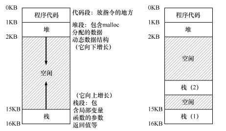

## 介绍
1. 单个运行进程提供的新抽象--线程（thread），经典的观点是一个程序只有一个执行点（一个程序计数器，用来存放要执行的指令），
但多线程程序会有多个执行点（多个程序计数器，每个都用于取指令和执行）。也可以看成，每个线程类似于独立的进程，但是他们共享
地址空间，从而能够访问相同的数据。
1. 单个线程的状态与进程的状态非常类似，线程有一个程序计数器（PC），记录程序从哪里获取指令，每个线程有自己的一组用于计算
的寄存器。所以如果有两个线程运行在一个处理器上，从运行一个线程（T1）切换到另一个线程（T2）时，必定发生上下文切换。线程之
间的上下文切换类似于进程间的上下文切换。对于进程，将状态保存到进程控制块（PCB）。现在我们需要一个或多个线程控制块（TCB），
保存每个线程的状态。但是与进程相比线程之间的上下文切换有一点主要区别：地址空间保持不变（即不需要切换当前使用的页表）。
1. 线程和进程之间的另一个主要区别在于栈，在简单的传统进程地址空间模型中只有一个栈，通常位于地址空间的底部。在多线程的进程
中，每个线程独立运行，当然可以调用各种例程来完成正在执行的任何工作。地址空间不只有一个栈，二十每个线程都有一个栈。
1. 如下图所示两个栈跨越了进程的地址空间，因此所有位于栈上的变量、参数、返回值和其他放在栈上的东西，将被放置在称为线程本地
（thread-local）存储的地方，即相关线程的栈。        
       
1. 线程的执行顺序取决于调度程序，并不是创建线程的顺序。当访问共享数据，就会得到不可预估的结果。
### 核心问题：不可控的调度
假如两个线程执行的操作都是对共享变量counter累加，当两个线程之一进入代码去并且将要增加一个计数器，它将counter的值（假设此
时为50）加载到它的寄存器eax中。因此线程1的eax=50。然后它向寄存器加1，因此eax=51。现在如果时钟中断发生。操作系统将当前正
在运行的线程（它的程序计数器、寄存器，包括eax等）的状态保存到线程的TCB。     
如果此时线程2被选中运行，并进入同一代码段。它也执行了同样的指令获取计数器的值并将其放入其eax中。此时counter的值仍为50，因
此线程2的eax=50。假设线程2执行递增此时它的eax为51，然后将eax的内容保存到counter中，则全局变量counter现在的值是51。       
最后又发生一次上下文切换，线程1恢复运行。还记得它已经执行过mov和add指令，现在准备执行最后一条mov指令，则counter再次被设置
为51。    
发生的情况就是：增加counter的代码被执行两次，初始值为50，但是结果为51。正常结果应该是52。     
由于执行代码的多线程可能导致竞争状态，因此我们将这段代码称为临界区。临界区是访问共享变量（共享资源）的代码片段，一定不能由
多个线程同时执行。我们真正想要的代码就是所谓的互斥（mutual exclusion）。这个属性保证了如果一个线程在临界区内执行，其他线、
程将被阻止进入临界区。
### 原子性
1. 解决临界区竞争问题的一种途径是拥有更强大的指令，单步就能完成要做的事，从而消除不合时宜的中断可能性。      
1. 假设一条指令将一个值添加到内存位置，并且硬件保证它以原子方式（atomiclly）执行。当指令执行时，它会像期望那样执行更新。
它不能在子指令中间中断，这正是我们从硬件获得的保证：发生中断时，指令根本没有运行，或者运行完成没有中间状态。
1. 原子方式的意思就是作为一个个单元。多条语句要由一条指令来做到这点，可以发出这条指令后完事，但是在一般情况下不会有这样的指
令。
1. 一般只是要求硬件提供一些有用的指令，可以再这些指令上构建一个通用的集合，即所谓的同步原语（synchronization primitive）。
通过使用这些硬件同步原语，加上操作系统的一些帮助，能够构建多线程代码，以同步和受控的方式访问临界区，从而可靠地产生正确的结
果。
1. 关键并发术语：
    1. 临界区：是访问共享资源的一段代码，资源通常是一个变量或数据结构。
    1. 竞态条件：出现在多个执行线程大致同时进入临界区时，它们都试图更新共享数据结构，导致了令人惊讶的结果。
    1. 不确定性程序由一个或多个竞态条件组成，程序的输出因运行二一，具体取决于哪些线程在何时运行。
    1. 为了避免这些问题，线程应该使用某种互斥原语。这样可以保证只有一个线程进入临界区，从而避免出现竞态，并产生确定的程序
    输出。
### 等待另一个线程
多线程除了临界区产生的问题，还有另一种常见的交互，即一个线程在继续之前必须等待另一个线程完成某些操作。如当进程执行磁盘I/O
并进入睡眠状态时，会产生这种交互。当I/O完成时，该进程需要从睡眠中唤醒，以便继续进行。
